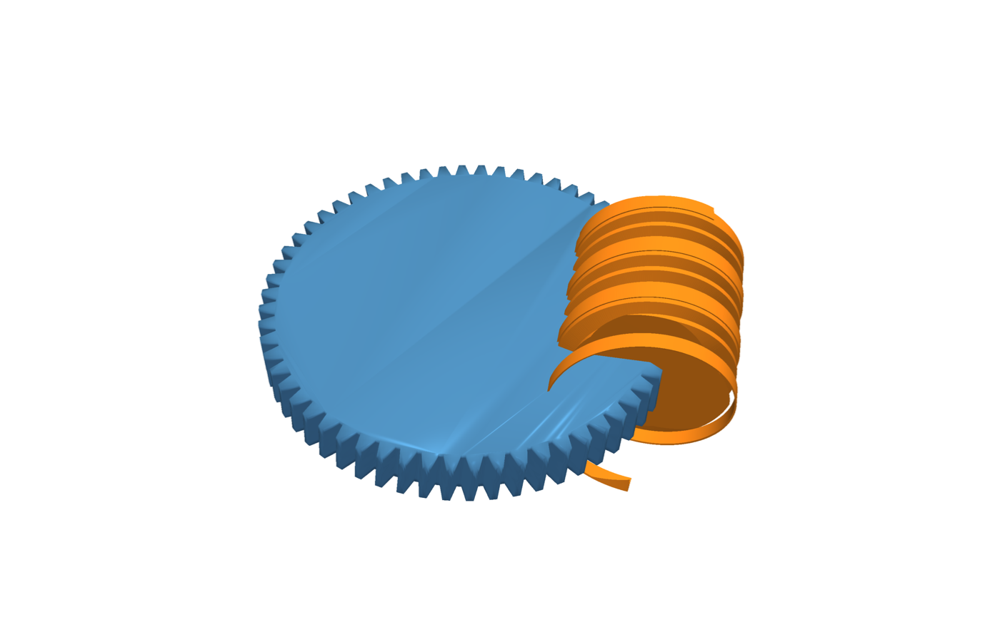

# Wormgear

**Worm gears for [build123d](https://build123d.readthedocs.io/), with real DIN-3975 engineering behind the geometry.**

[](https://pypi.org/project/wormgear/)
[](https://pypi.org/project/wormgear/)
[](https://github.com/pzfreo/wormgear/actions/workflows/ci.yml)
[](https://opensource.org/licenses/MIT)



```python
from wormgear import WormGear, WormWheel

worm  = WormGear(module=2.0, num_starts=1, length=40)   # is a build123d Part
wheel = WormWheel(module=2.0, num_teeth=30)             # is a build123d Part

worm.export_step("worm.step")
wheel.export_step("wheel.step")
```

Or for a guaranteed-matched pair in one line:

```python
from wormgear import make_pair

worm, wheel = make_pair(module=2.0, ratio=30, length=40)
```

That's the whole API for most users. Both classes subclass `build123d.BasePartObject`, so you can `show()`, `export_step()`, or compose them into assemblies directly.

## Why use this

Wormgear supplements the excellent build123d gear ecosystem ([bd_warehouse](https://github.com/gumyr/bd_warehouse) for spur gears and other parts, [py_gearworks](https://github.com/GarryBGoode/py_gearworks) for spur / helical / bevel / cycloid / inside-ring) with specialist support for worm gears, which neither of those libraries currently covers.

What it does:

- **Implements real DIN-3975 derivation.** Lead angle, pitch diameter, addendum/dedendum, throat radius for globoid worms — all standards-compliant rather than approximate.
- **Calculates load-capacity-relevant fields** per DIN-3996 (efficiency estimate, self-locking detection, recommended materials).
- **Generates exact geometry.** No "good enough after manufacturing" approximations — the STEP file is exactly what your CNC will cut or your printer will print.
- **Two tooth profiles**: ZA (straight flanks, CNC-friendly), ZK (slightly convex, 3D-print-friendly).

## Install

```bash
pip install wormgear
```

Requires Python 3.12+. `build123d` (and its OpenCascade backend) installs automatically.

## Beyond the basics

### Engineering analysis

```python
from wormgear import make_pair, check_mesh

worm, wheel = make_pair(module=2.0, ratio=30, length=40)

# Kinematic mesh validation (independent of how the gears were built)
report = check_mesh(worm._params, wheel._params, worm._assembly_params)
print(f"ok: {report.ok}, ratio: {report.ratio}, "
      f"centre distance: {report.centre_distance_mm:.2f} mm")
```

For full DIN-3975 design analysis (efficiency, self-locking, undercut, etc.):

```python
from wormgear.calculator import design_from_module, validate_design

design = design_from_module(module=2.0, ratio=30)
result = validate_design(design)
print(f"efficiency: {design.assembly.efficiency_percent:.1f}%, "
      f"self-locking: {design.assembly.self_locking}")
for msg in result.warnings:
    print(f"warning: {msg.message}")
```

### Features (bores, keyways, set screws)

```python
from wormgear import WormGear
from wormgear.core import BoreFeature, KeywayFeature

worm = WormGear(
    module=2.0, num_starts=1, length=40,
    bore=BoreFeature(diameter=8.0),
    keyway=KeywayFeature(),  # auto-sized DIN-6885 keyway
)
```

### Web calculator

Don't want to write any code? [wormgear.studio](https://wormgear.studio) is the browser-based version of the calculator. It produces a JSON file you can load:

```python
from wormgear import WormGear, WormWheel
from wormgear.io import load_design_json

design = load_design_json("my-design.json")
worm  = WormGear.from_design(design, length=40)
wheel = WormWheel.from_design(design)
```

### CLI

For shell-driven workflows (CAM pipelines, batch generation):

```bash
wormgear design.json -o out/
wormgear design.json --profile ZK --globoid --worm-bore 8
```

See `wormgear --help` for the full set of options. (`wormgear-geometry` is kept as a backwards-compatible alias.)

### Advanced: virtual hobbing

For high-precision conjugate contact (e.g. high-load applications or contact-stress analysis), `wormgear.advanced.virtual_hobbing` kinematically simulates the hobbing manufacturing process — slower than `throated=True`, but produces sub-tenth-percent-accurate tooth flanks:

```python
from wormgear import WormGear, WormWheel
from wormgear.advanced import virtual_hobbing

worm = WormGear(module=2.0, num_starts=1, length=40)
wheel = WormWheel(module=2.0, num_teeth=30)
precise_wheel = virtual_hobbing(worm, wheel, steps=72)
```

Most users want plain `WormWheel(throated=True)` — reach for this when you specifically need kinematic accuracy.

## Known limitations

- **Even-numbered multi-start worm STL is slightly non-watertight.** For `num_starts ∈ {2, 4, 6, ...}` the two opposing thread surfaces meet at a single shared vertex on the symmetry plane (a real OCC topology with `is_valid=True`, but degenerate for tessellation). The exported STL has ~6 open edges out of ~10,000 — about 0.06 % of the mesh. STEP output is unaffected and round-trips perfectly. Most STL slicers (Cura, PrusaSlicer) tolerate the open edges and slice normally; strict mesh-repair tools may flag them, and the workaround is a "make watertight" pass in Blender or Meshmixer. **1-start and odd-numbered multi-start worms are clean.** See [#223](https://github.com/pzfreo/wormgear/issues/223) for the diagnostic and attempted fixes.

## Related libraries

Wormgear is one library in the build123d gear ecosystem:

- [`bd_warehouse`](https://github.com/gumyr/bd_warehouse) — spur gears, fasteners, bearings, threads, sprockets
- [`py_gearworks`](https://github.com/GarryBGoode/py_gearworks) — spur, helical, bevel, cycloid, and inside-ring gears

Use them together: spur / helical gears from bd_warehouse or py_gearworks for parallel-shaft stages, wormgear for perpendicular reduction stages.

## Documentation

- [Architecture](docs/ARCHITECTURE.md) — system design
- [Geometry](docs/GEOMETRY.md) — technical specification
- [Engineering Context](docs/ENGINEERING_CONTEXT.md) — DIN-3975/DIN-3996 background

## Background

Created for custom worm gear design in luthier (violin making) applications, where standard gears don't fit unusual envelope constraints. Extended to support CNC machining and 3D printing for makers and engineers.

## License

MIT

## Author

Paul Fremantle ([@pzfreo](https://github.com/pzfreo))

## How this was built

This project was coded entirely by AI under human direction. The design decisions, engineering requirements, and review were directed by a human; the implementation was written by AI.
